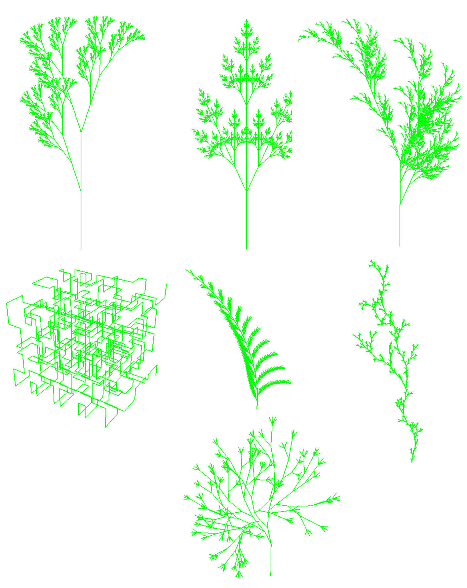

# L-System

This project implements a **3D bracketed L-system** using a **turtle interpretation** in **OpenGL**. It generates procedural structures such as plants or trees by rewriting strings according to a set of rules and interpreting them as turtle movements in 3D space.

## Features

- Fully supports **3D bracketed L-systems**.
- Implements standard **turtle commands**:
  - `+`: turn left by angle 𝛼  
  - `-`: turn right by angle 𝛼  
  - `&`: pitch down by angle 𝛼  
  - `^`: pitch up by angle 𝛼  
  - `\`: roll left by angle 𝛼  
  - `/`: roll right by angle 𝛼  
  - `|`: turn around by 180°  
  - `[`: push current state to stack  
  - `]`: pop state from stack  
- Uses **rotation matrices** to transform heading, left, and up vectors.
- Dynamic **rule parsing** and iterative string rewriting.
- Efficient **OpenGL buffer setup** for rendering vertex arrays.
- Supports multiple line segments using `NAN` separation in vertex arrays.

## Usage

- Compile and run the program.
- Use keys `1-6` for 2D L-systems and `7-0` for 3D L-systems.
- Move camera with **WASD**, **Space**, and **Shift**.
- Rotate view with mouse; zoom with scroll wheel.
- Toggle animation with **P**.

## Requirements

- **C++17** or newer  
- **OpenGL**  
- **GLM** (OpenGL Mathematics library)  
- **GLEW/GLFW** for window/context management